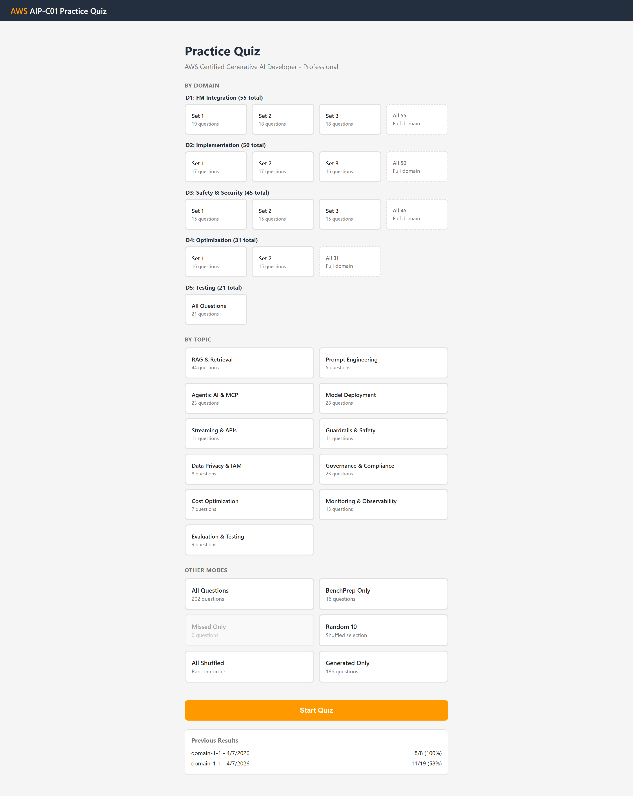

# AIP-C01 Practice Quiz

A self-contained practice quiz application for the **AWS Certified Generative AI Developer - Professional (AIP-C01)** exam. 202 scenario-based questions across all 5 exam domains with constraint-based trade-off patterns matching real exam difficulty.

Built with Python stdlib + vanilla HTML/JS. Zero dependencies.



## Features

- **202 questions** across 5 exam domains, 93% skill coverage against the official exam guide
- **Domain sets of 15-20 questions** for manageable ~30 minute study sessions
- **Task-balanced distribution** — round-robin interleaving ensures each set covers all tasks in the domain
- **Topic-focused drill-down** — practice specific areas like RAG, Agents, Guardrails, Cost Optimization
- **Randomized answer order** — A-D positions shuffled each session to prevent memorization
- **3-attempt retry for missed questions** — immediate reinforcement with reshuffled answers and attempt history
- **Multiple quiz modes** — by domain, by topic, all, missed only, random 10, shuffled, BenchPrep, generated
- **Detailed explanations** — every answer (correct AND incorrect) includes 4+ sentence rationale
- **Progress tracking** — persisted to JSON, resume across sessions
- **Keyboard shortcuts** — 1-5 select, Enter check/next, arrows navigate, F flag

## Quick Start

```bash
python quiz_server.py
```

Opens automatically at `http://localhost:8765`. No pip install needed.

## Question Sources

Questions are stored as Obsidian-compatible markdown files and parsed at startup:

| Source | Questions | Description |
|--------|-----------|-------------|
| Domain 1-5 generated | 50 | Core domain questions, revised with trade-off patterns |
| Trade-off scenarios | 25 | Reddit test-taker informed, constraint-based |
| Safety & governance | 10 | Guardrails, PII, bias, compliance deep-dive |
| Agentic AI | 8 | AgentCore, Strands Agents, MCP |
| Service differentiation | 10 | Bedrock vs SageMaker, OpenSearch vs pgvector |
| Skill Builder extracted | 33 | Converted from official AWS Skill Builder |
| Screencapture trade-offs | 30 | ANN algorithms, chunking, circuit breakers |
| Gap-filling | 20 | Targeting uncovered exam guide skills |
| BenchPrep practice/bonus | 16 | Official AWS practice questions |

## Domain Coverage

| Domain | Weight | Questions | Sets |
|--------|--------|-----------|------|
| D1: FM Integration, Data, Compliance | 31% | 55 | 3 sets (19/18/18) |
| D2: Implementation & Integration | 26% | 50 | 3 sets (17/17/16) |
| D3: Safety, Security, Governance | 20% | 45 | 3 sets (15/15/15) |
| D4: Operational Efficiency | 12% | 31 | 2 sets (16/15) |
| D5: Testing & Troubleshooting | 11% | 21 | 1 set (21) |

## Architecture

```
quiz_server.py          quiz_app.html
┌────────────────┐     ┌──────────────────────┐
│ Markdown Parser│     │ Start Screen         │
│   - Callout    │     │   - Domain sets      │
│   - Frontmatter│     │   - Topic drill-down │
│ Domain/Task    │     │   - Other modes      │
│   Classifier   │────►│ Quiz Screen          │
│ Task           │     │   - Answer shuffle   │
│   Interleaver  │     │   - Domain sidebar   │
│ HTTP Server    │     │ Results Screen       │
│   - JSON API   │     │   - 3-retry missed   │
│   - Progress   │     │   - Attempt history  │
└────────────────┘     └──────────────────────┘
```

## Question Format

Questions use Obsidian callout syntax for dual-use — they render in both the quiz app and Obsidian:

```markdown
## Question 1

> [!question] Question — Title (Domain 1)
> Scenario with a hard constraint...
>
> **A.** Option that violates the constraint
> **B.** Correct option satisfying all requirements
> **C.** Overengineered solution
> **D.** Wrong service for this context

> [!example]- Answer: B
> **A. Incorrect.** Explanation...
> **B. Correct.** Explanation...
```

## Creating Your Own Quiz

This app can be adapted for any certification exam. See the `skill/` directory:

- **`skill/SKILL.md`** — Complete workflow: setup exam guide, generate questions, gap analysis, build app
- **`skill/QUESTION-GENERATION-GUIDE.md`** — How to write high-quality constraint-based questions
- **`skill/DOMAIN-SOURCE-MAP.md`** — AIP-C01 specific source-to-domain mapping

### Pipeline

1. Upload your exam guide/syllabus
2. Ingest source documents (official docs, course material, test-taker intel)
3. Generate constraint-based trade-off questions tagged by domain and task
4. Run gap analysis against the exam guide
5. Fill coverage gaps with targeted questions
6. Build and launch the quiz app

## License

Personal use. Question content is derived from AWS documentation and exam preparation materials.
